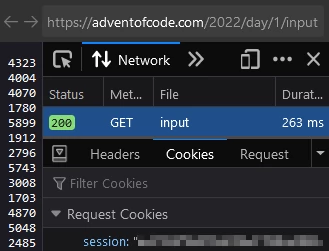

# Advent Of Code Typescript
My solutions for [Advent of Code](https://adventofcode.com).

## Usage
Ensure you have `npm`, have ran `npm i`, and [have set up your AOC token](#advent-of-code-token)

If it's currently December, you can run today's solution by simply doing
```
npm start
```
If it's not December, the you must specify the solution you wish to run with the `year` and `day` arguments
```
npm start -- --year=YEAR --day=DAY --part=PART
```

If you only want to run your solution for a single part of the problem, do
```
npm start -- --part=1
```

## Advent Of Code Token
1. go to any AOC input in your browser, such as [2022/day/1/input](https://adventofcode.com/2022/day/1/input)
2. <key>ctrl</key>+<key>shift</key>+<key>i</key> to open devtools
3. go to the "Network" tab of the devtools and refresh the page
4. click the request that looks like "200 GET INPUT"
5. click the "Cookies" tab of the request view, and copy the value of session


Once you have your token, create `.env` with your token, using `.env.example` for help with formatting.
